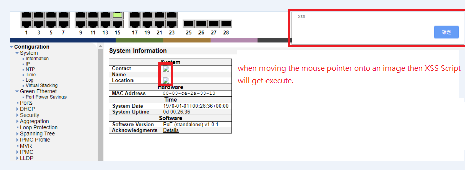

# PSG-6528VM-xss

Vendor: eten Technologies Inc.
Product: PSG-6528VM
Version: 1.1
Vulnerability: Cross-Site Scripting

# Information

Cross-site Scripting vulnerability in  PSG-6528VM
This attack appear to be exploitable via payload onmouseover.

Researcher: jason (https://github.com/leona4040/)

# POC

*Attack Scenario: Stored Cross Site Scripting*

Step 1. Login into PSG-6528VM.  

Step 2: Go to system information configuration page.  

Step 3: User can inject payload in "System Contact" & "System Location" field.  

        payload:

Step 4: Then click on save   

Step 5: when moving the mouse pointer onto an image then XSS Script will get execute.   

# Screenshots:

  

